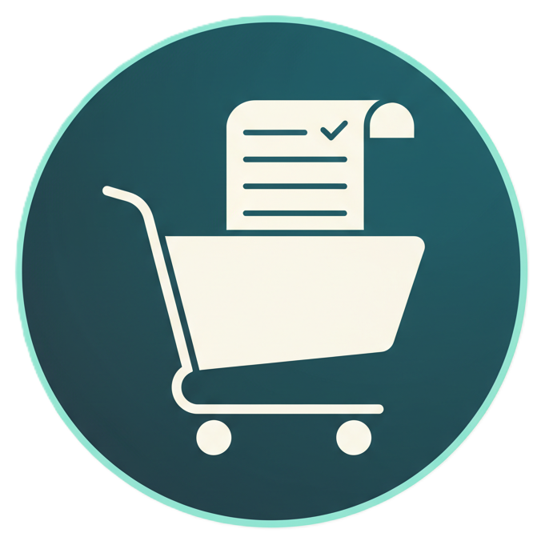
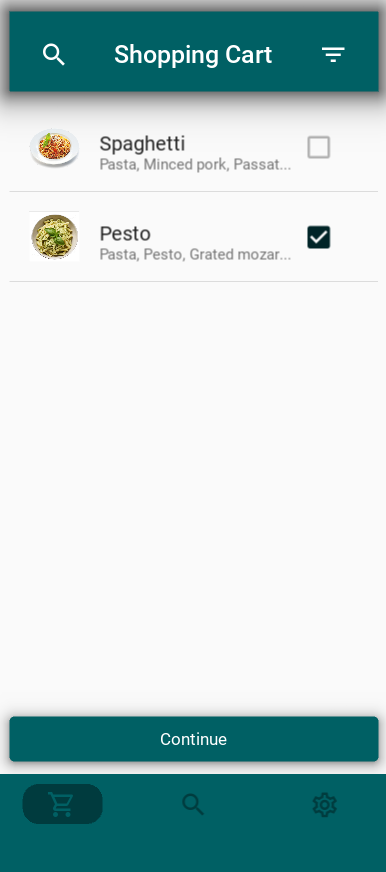
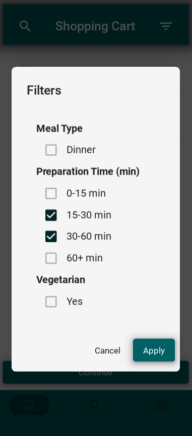
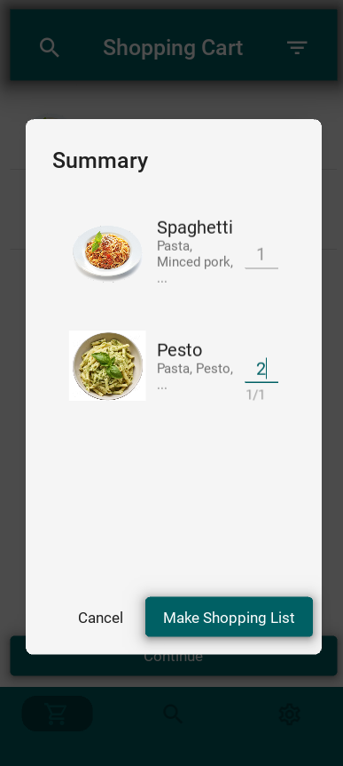
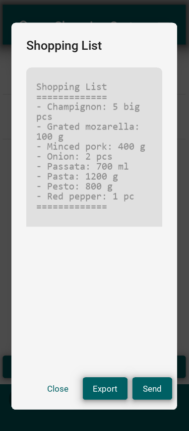
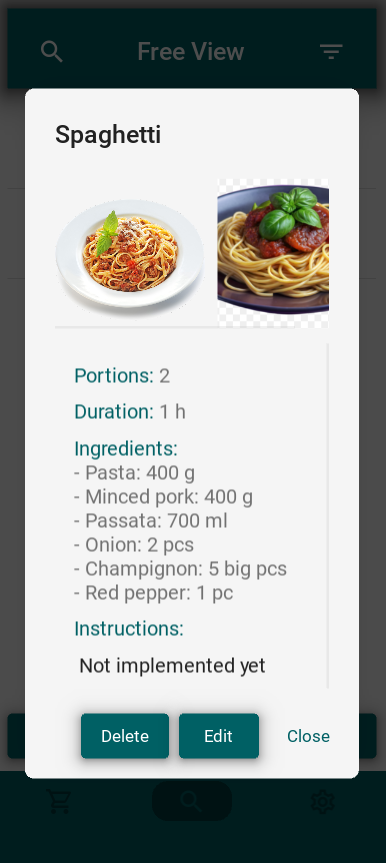
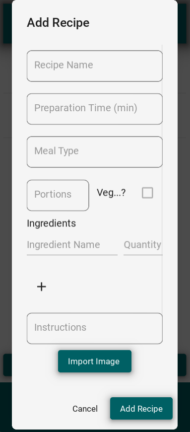
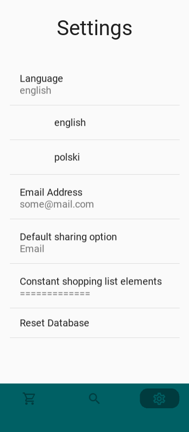
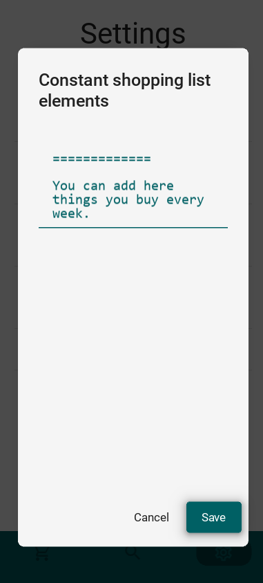
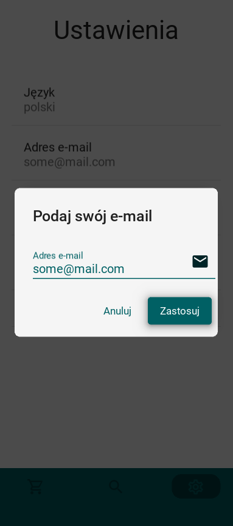

<p align="center">
  
</p>

<h1 align="center">TheCart</h1>

<p align="center">
  A small mobile app for making a quick shopping list.
  <br><br>
  
  
  
</p>

---

### 🛒 About The Project

**TheCart** is a simple and intuitive mobile application designed to help you quickly create and manage your shopping lists. Built with ease-of-use in mind, it allows you to build lists from your favorite recipes, edit them on the fly, and even manage recurring items.

---

### ✨ Features

* **Recipe-Based Lists:** Quickly add all ingredients from a recipe to your shopping list.
* **Powerful Filtering:** Easily search and filter your recipes to find what you need.
* **List Customization:** Edit, configure, and export your final shopping list.
* **Easy Sharing:** Send the completed shopping list directly to your email for maximum ease and comfort in the store.
* **Recipe Management:** A dedicated view for adding, viewing, and editing recipes.
* **Constant Elements:** Manage items that are always on your list (e.g., milk, bread).
* **Multi-Language Support:** Available in English and Polish.

---

### 📸 Screenshots

<table>
  <tr>
    <td align="center"><strong>Shopping Cart View</strong></td>
    <td align="center"><strong>Filters & Search</strong></td>
    <td align="center"><strong>List Summary</strong></td>
  </tr>
  <tr>
    <td></td>
    <td></td>
    <td></td>
  </tr>
  <tr>
    <td align="center"><strong>Final Shopping List</strong></td>
    <td align="center"><strong>Recipe Management</strong></td>
    <td align="center"><strong>Add/Edit Recipe</strong></td>
  </tr>
  <tr>
    <td></td>
    <td></td>
    <td></td>
  </tr>
    <tr>
    <td align="center"><strong>Settings</strong></td>
    <td align="center"><strong>Constant Elements</strong></td>
    <td align="center"><strong>Polish Language</strong></td>
  </tr>
  <tr>
    <td></td>
    <td></td>
    <td></td>
  </tr>
</table>

---

### 🚀 Getting Started

#### Prerequisites

Make sure you have Python 3 installed on your system.

#### Setup Virtual Environment

1. **Create a virtual environment:**
   ```bash
   python3 -m venv venv
   ```

2. **Activate the virtual environment:**
   - On Linux/Mac:
     ```bash
     source venv/bin/activate
     ```
   - On Windows:
     ```bash
     venv\Scripts\activate
     ```

3. **Install dependencies:**
   ```bash
   pip install -r requirements.txt
   ```

4. **Run the application:**
   ```bash
   python main.py
   ```